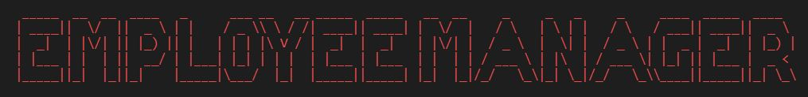
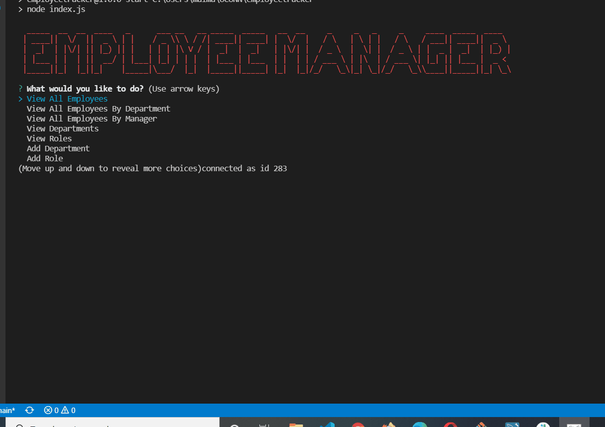

# 🧑‍💼 Employee Manager


[](https://opensource.org/licenses/MIT) 

## 📝Description

```
This is a Node.js command-line application allows the user to
manage their employees in a Content Management System.
The user will have the ability to view and manage departments,
roles, and employees in their company. 
```


## 🧰 Technologies Used

* `Node.js`
* `npm (Node Package Manager)`
* `Javascript`
* `Inquirer`
* `Figlet`
* `Chalk`
* `MySql`
* `Console.table`

## 📄 Installation Instructions

You will need to install the following packages using npm. You will also need a local installation of MySql with Workbench if you want to install and test the applciation locally. A `dbschema.sql` file and a `seed.sql` file can be found in the assets/sql folder to get you started.
* [Node](https://nodejs.org/en/)
* [Inquirer](https://www.npmjs.com/package/inquirer)
* [Figlet](https://www.npmjs.com/package/figlet)
* [Chalk](https://www.npmjs.com/package/chalk/v/1.0.0)
* [MySql](https://www.npmjs.com/package/mysql)

---

🎥  [Video Demonstration](https://drive.google.com/file/d/1S_Ns-R-o3poZFmTGxZJVrRXVcwTr_8NM/view?usp=sharing)

## 🤸‍♂️Challenges/Successes

## 📸 Screenshots


## 📱 Contact 

Malcolm Mason - [Github](https://github.com/malmason) Email: [Malcolm](mailto:malmason66@gmail.com) 📧

---

&copy; 2021 Malcolm Mason